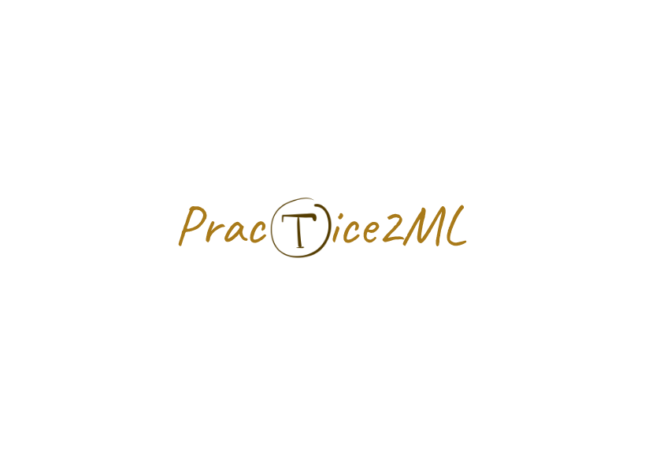

这个项目主要关于机器学习实践，主要为理论知识的学习加上实战的代码练习。通过本项目的学习，你将学到一些有用的工具、数据处理方式、特征工程、机器学习理论知识以及模型调用、深度学习理论知识以及使用Pytorch的实际应用。

- 理论知识根据个人的需求和时间灵活安排。
- 每`周一`我们将发布练习项目，你需要按照指示完成练习项目，并`提交相关代码`。

本项目包含的内容如下。

[TOC]

# 第一部分--理论知识

## 1. 基础

### 1.1 环境配置

#### 1.1.1 Linux

学习Linux是一个有趣的过程，学完之后可以进一步了解操作系统，由于对开发环境良好的生态支持以及广泛的问题解决方案， Linux用户配置环境相当舒适。

- [B站视频教程](https://www.bilibili.com/video/BV1mW411i7Qf?from=search&seid=3369310834584723371)
- [手把手教你安装Linux虚拟机](https://zhuanlan.zhihu.com/p/41940739)
- [windows10安装ubuntu双系统教程](https://www.cnblogs.com/masbay/p/10745170.html)

#### 1.1.2 Anaconda | miniconda

conda 用来管理虚拟环境，安装库。

- [Anaconda 安装和使用--Windows10](https://www.cnblogs.com/hichens/p/12258831.html)
- [Anaconda 安装和使用--Ubuntu](https://zhuanlan.zhihu.com/p/36053560)

#### 1.1.3 IDE

本人只用过Pycharm和VScode，推荐VScode。

- [Pycahrm+Anaconda](https://www.cnblogs.com/yuxuefeng/p/9235431.html)
- [VScode+Anaconda](https://blog.csdn.net/u013187057/article/details/83418425)

### 1.2 Python教程

- [《Python编程：从入门到实践》](https://github.com/LSayhi/Python/blob/master/Python%E7%BC%96%E7%A8%8B%EF%BC%9A%E4%BB%8E%E5%85%A5%E9%97%A8%E5%88%B0%E5%AE%9E%E8%B7%B5.pdf)
- [《中文Python笔记》](https://github.com/lijin-THU/notes-python)

### 1.3 工具

- Google：吊打一切的搜索引擎
- Github：程序员交友网站
- Spotify：代码与音乐更配哦
- [我的Ubuntu配置](https://www.cnblogs.com/hichens/p/13870069.html)

## 2. 数据处理

### 2.1 Numpy

Numpy 是很多库的基础，跟着下面的教程敲一遍差不多了。

- [Numpy教程](https://github.com/lijin-THU/notes-python/tree/master/03-numpy)

### 2.2 Pandas

Pandas 是非常好用数据处理工具。

- [Joyful-Pandas](https://github.com/datawhalechina/joyful-pandas)

### 2.3 可视化

- Matplotlib: [Matplotlib可视化最有价值的50个图表](https://www.jiqizhixin.com/articles/2019-01-15-11)
- Seaborn: [seaborn可视化](https://www.cnblogs.com/hichens/p/13295559.html)
- Pyecharts: [pyecharts(1)基本图](https://www.cnblogs.com/hichens/p/13531749.html)| [pyecharts(2)图的布局](https://www.cnblogs.com/hichens/p/13532017.html)| [pyecharts(3)配置](https://www.cnblogs.com/hichens/p/13533802.html)

## 3. 机器学习

### 3.1 Sklearn

- [《Python机器学习基础教程》](https://github.com/pudongqi/Introduction-to-Machine-Learning-with-Python/blob/master/Python%E6%9C%BA%E5%99%A8%E5%AD%A6%E4%B9%A0%E5%9F%BA%E7%A1%80%E6%95%99%E7%A8%8B.pdf)

### 3.2 理论知识

- [吴恩达机器学习课程](https://www.bilibili.com/video/BV164411b7dx?from=search&seid=13151362994692254063)
- [西瓜书](https://github.com/Mikoto10032/DeepLearning/blob/master/books/%E6%9C%BA%E5%99%A8%E5%AD%A6%E4%B9%A0%E5%91%A8%E5%BF%97%E5%8D%8E.pdf)
- [《统计学习方法》](https://github.com/yuanliangding/books/blob/master/%E8%AE%A1%E7%AE%97%E6%9C%BA-%E4%BA%BA%E5%B7%A5%E6%99%BA%E8%83%BD-%E6%9C%BA%E5%99%A8%E5%AD%A6%E4%B9%A0/%E7%BB%9F%E8%AE%A1%E5%AD%A6%E4%B9%A0%E6%96%B9%E6%B3%95(%E6%9D%8E%E8%88%AA).pdf)

## 4. 深度学习

### 4.1 Pytorch

- [动手学习深度学习--Pytorch](https://github.com/ShusenTang/Dive-into-DL-PyTorch)
- [油管Pytorch视频教程](https://www.youtube.com/playlist?list=PLhhyoLH6IjfxeoooqP9rhU3HJIAVAJ3Vz)
- [对应视频的源代码](https://github.com/aladdinpersson/Machine-Learning-Collection)

### 4.2 理论知识

- [花书](https://github.com/exacity/deeplearningbook-chinese/releases/download/v0.5-beta/dlbook_cn_v0.5-beta.pdf)
- 《动手学习深度学习》

# 第二部分--练习实战

## 5. 项目实战

### 5.1 机器学习

#### 5.1.1 无特征处理

- [鸢尾花分类](./week1/iris)
- [EEG情感分类](./week1/EEG)

#### 5.1.2 有特征处理

- 泰坦尼克之灾
-  波士顿房价预测

### 5.2 深度学习

#### 5.2.1 过渡

- 手写数字识别

#### 5.2.2 深入

- 图像风格迁移
- 车牌检测识别

## 6. 作业提交方式

将我的项目克隆到本地，自己将写好的代码上传到github，并将链接发送到群里。互相学习代码有利于提高代码能力。

Enjoy It !